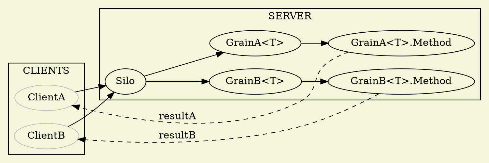

[Orleans项目地址](https://github.com/dotnet/orleans)

# 基本概念
[Actor模式](https://en.wikipedia.org/wiki/Actor_model)
Grain <-> (Virtual) Actor
Virtual表现在，调用方无需知道Grain的存活情况，可以假设Grain一直存活。
Orleans项目整体组成大致分为 Client 和 Server两部分, 两个模块之间使用GrainInterface作为约束, Grain寄宿在Silo中, Grain包含了实际执行的代码实现。
```CSharp
public interface IGrainInterface: IGrainWithIntegerKey
{
  Task<string> Method1(string str);
}

public class GrainImp : IGrainInterface
{
  public async Task<string> Method1(string str)
  {
    return await Task.FromResult($"Hello {str}")
  }
}

```
# 持久化(状态)
Orleans为持久化提供了较为方便的接口, 由于Actor模式的原因, 在GrainImpl中使用状态的存取时, 也不用担心并发等问题。
在GrainImpl上添加继承Grain<TState>类, 其中TState是该Grain所需要持久化的状态。
``` CSharp
public class Person
{
  public string Name {get;set;}
}

public interface IPersonGrain: IGrainWithIntegerKey
{
  Task<string> HelloAsync(string name);
}

public class PersonGrain: Grain<IList<Person>, IGrainInterface
{
  public async Task<string> HelloAsync(string name)
  {
    await ReadStateAsync();//读取现有状态, State为IList<Person>类型
    State.Add(new Person(){Name=name});
    await WriteStateAsync();//写入更改后的状态
    return await Task.FromResult($"Hello {name}")

  }
}

```

# 一般执行的流程大致如下:   




