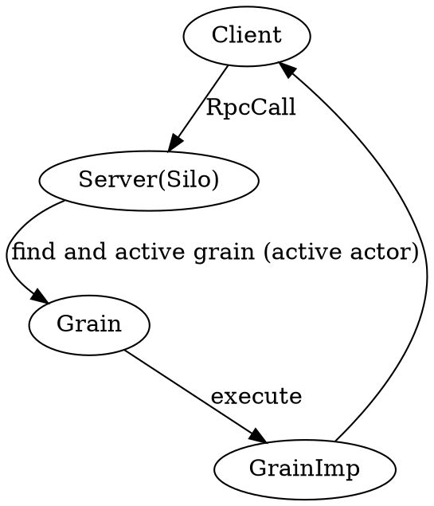

[Orleans项目地址](https://github.com/dotnet/orleans)
# 几个概念

Grain <-> Actor
Orleans项目整体组成大致分为 Client 和 Server两部分，两个模块之间使用GrainInterface作为约束, Grain寄宿在Silo中，Grain包含了实际执行的代码实现, 执行的流程大致如下:   

```graphviz
digraph G {
  "Client" -> "Server(Silo)" [label="RpcCall"]
  "Server(Silo)"->"Grain" [label="find and active grain (active actor)"]
  "Grain"->"GrainImp" [label="execute"]
  "GrainImp"->"Client"
}
```